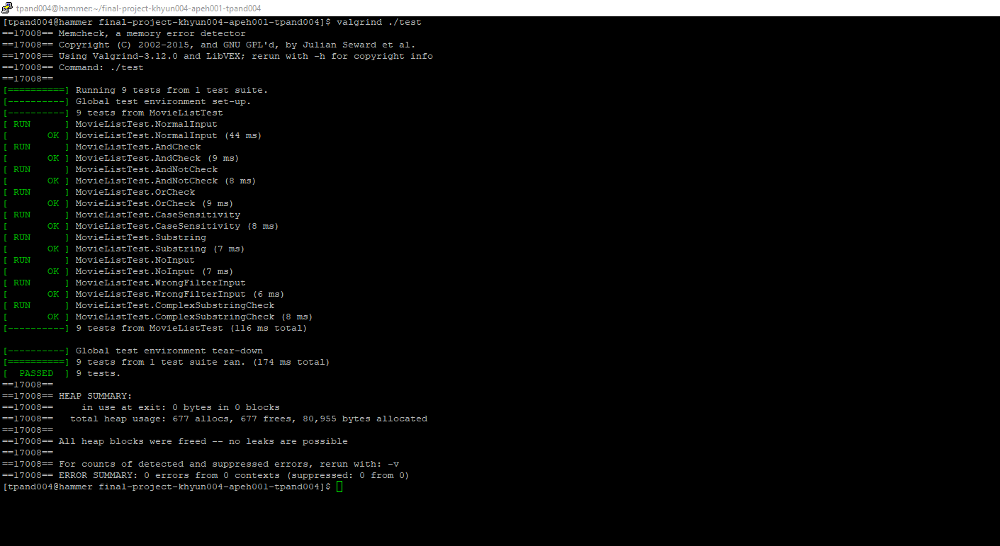

# Movie Recommender
 
 > Authors: Kristie Hyun github.com/khyun004 , Tanya Pandit github.com/pandit-tanya , Allan Peh github.com/apeh001

## Project Description

This project is interesting to us because we all love watching movies on Netflix, and this project would help us better understand the algorithm behind Netflix and how they are able to recommend certain movies to us.
 

[C++](link) - We all took the CS010 series, so we are all comfortable with this particular language. We will add other tools that we find as further progress through our project plans.

We will be coding our project in C++ since that is the language that we are all comfortable with. We tried to add movies of all types and got our titles from https://www.filmsite.org/boxoffice.html. Then we used the website Rotten Tomatoes to get the movies' ratings and got the rest of the information needed such as movie length from Google.
The input for our project is that the user would input a genre and the output of the project would be a list of movies of that particular genre. It doesn't just have to be the genre as well; they could input other choices such as length of the movie, and our algorithm would recommend movies based on those filters. They would also be able to choose up to 2 filters, and have the choice of being recommended movies based on filter 1 and filter 2, filter 1 or filter 2, or filter 1 and not filter 2.
We will be using a composite design pattern. We will use the composite design pattern because it would be easy for us to visualize it. We would have separate categories such as genre or release date. And the categories below these would be something like sub-genre or a specific director, etc. The composite design pattern would allow us to divide our classes into hierarchies based on their categories. The second design pattern we plan on using is the strategy pattern. Actually, our strategy will also be our composite pattern. The user will be recommended a list of movie recommendations based on what they input, and there could be many different recommendation algorithms behind the scenes that the user doesn't know about. There could be recommendations that are sorted based on genre, release time, length, etc. To implement these ideas there would be many algorithms that are all similar but slightly different to create the recommendation lists, which is why we think the strategy design pattern would work.

A problem that we are worried that we might run into is if our filters clash or if we need to implement more filter classes for our sorting algorithms.  Another problem is that there are multiple ways to recommend a movie, so we would have to implement many algorithms depending on what characteristics we decide to include.

The composite design pattern works well because it allows us to implement our strategy pattern within the composite, so our strategy pattern functions can inherit from it. Composite design can also separate our classes into hierarchies, which includes the strategy design. The strategy design pattern would work well in helping us implement our multiple recommendation algorithms because we could create objects based on the recommendation categories without having to change too much of our code.

## Class Diagram (Composite and Strategy)

 

Our strategy pattern is within our Composite Pattern. The composite, which are the strategies, are our AND, NOT, FIND, Filter_feature, and OR classes, which help to find movies with specific features and filter them out. Our AND, OR, and NOT classes enable the user to add a second filtration method. For example, if they choose AND, the can filter movies that contain two specific features but if they select OR, movies that have either of those features will be outputted. Our Component is our Filter class, which the strategies inherit from. Our Composite pattern leaf is the MovieList class objects, which are vectors that hold all of the movie information like title, genre, range of length, range of rating, and range of release year.
 
## Screenshots
 
 
 
 This are the screenshots for our input and output. The inputs are the numbers and letters that the user will be inputting and the outputs are the list of movies.

## Installation/Usage
 To install our application, you need to clone our github repository. In order to do so, you will need to input the command "git clone --recursive https://github.com/cs100/final-project-khyun004-apeh001-tpand004". After doing this, all you would need to do is run the application. To do so, you would type "./movieList" and it will take you to a message, prompting you to type in 1, 2, 3, or 4 to choose a filter. Make sure to type in only one of these four numbers, because doing so incorrectly will have you restart the whole process over again.  After choosing a filter, the application will ask you to pick if you want another filter or if you're satisfied. If you are, then the application will output the list of movies with that filter. If not, then you can add another filter to narrow your search. After adding the second filter, the application will output the list of movies that meet the requirements.

## Testing
 Our project was tested through a series of unit tests and verified that the functionality of our program works with every single possible combination of inputs. All of our unit tests passed with the correct outputs.
 
 
